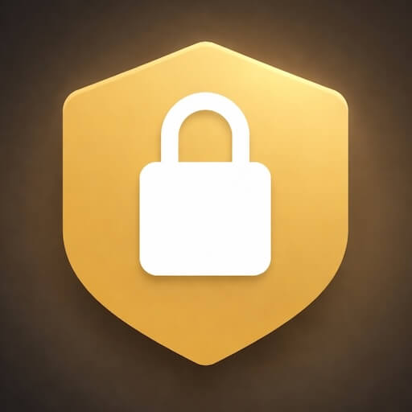
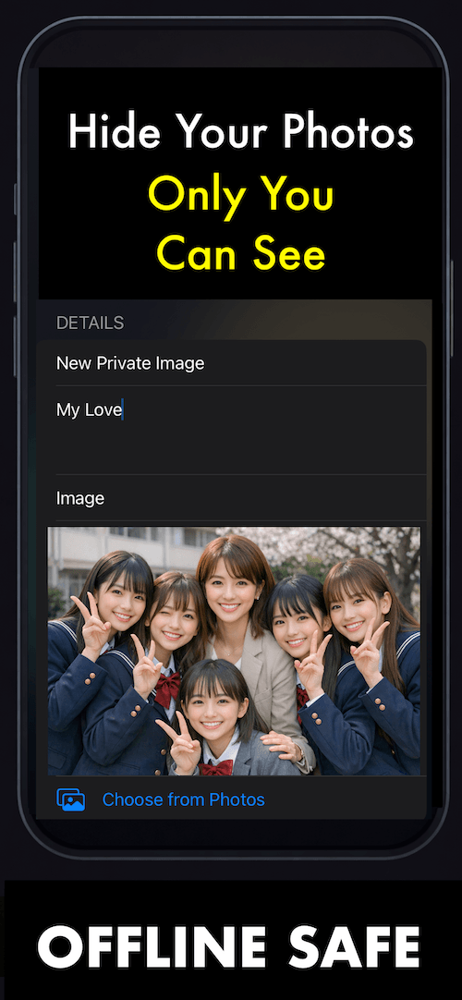
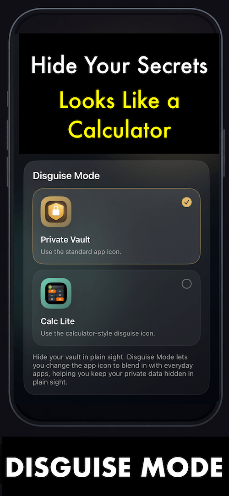
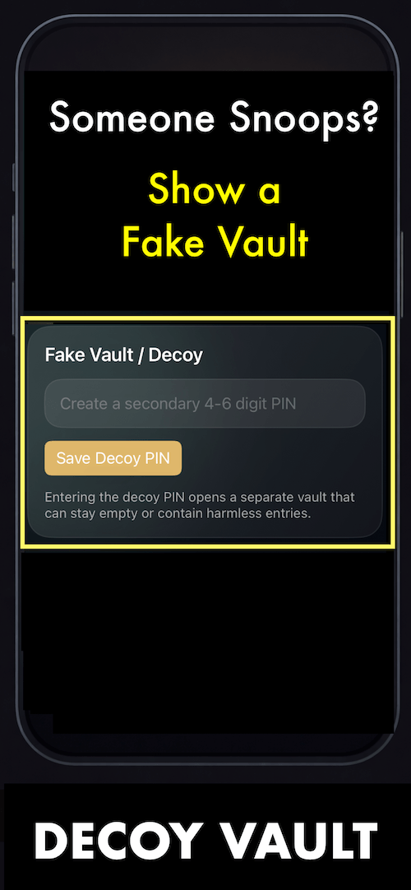

# Private Vault – Offline Safe

  

  <strong>Private storage for your most sensitive data — 100% offline.</strong>

  No cloud. No account. No tracking. Ever.

  <a href="https://apps.apple.com/us/app/private-vault-offline-safe/id6762105214"><strong>Download on the App Store</strong></a>

---

## Overview

**Private Vault – Offline Safe** is a simple yet powerful secure storage app designed to keep your most sensitive data truly private — directly on your device.

Built for users who value privacy, speed, and simplicity, the app provides a clean and intuitive space to store personal notes, private images, and important passwords without relying on cloud services, user accounts, or third-party tracking.

Everything stays on your device. Nothing is uploaded. Nothing is shared.

---

## Why Private Vault

In a world where many apps depend on servers, accounts, and analytics, **Private Vault – Offline Safe** takes a different approach:

- **100% offline by design**
- **No cloud sync**
- **No account required**
- **No tracking**
- **Fast, lightweight, and private**

This makes the app ideal for storing sensitive information locally, with full control remaining in the hands of the user.

---

## Key Features

### Secure by Design
Protect your vault with strong local access control:

- PIN protection
- Optional Face ID support
- Automatic lock when the app goes to the background

Your private content stays protected from casual access while remaining quick and convenient for everyday use.

### Store What Matters
Manage essential private content in one place:

- **Private Notes**
- **Private Images** from Photos or Camera
- **Passwords and account information** with quick copy support

The app is designed for fast interaction, allowing users to add, edit, delete, and search their content instantly with a clean, intuitive interface.

### True Offline Privacy
Unlike cloud-first storage tools, **Private Vault – Offline Safe** keeps everything directly on the device.

- No remote server dependency
- No background syncing
- No account registration
- No analytics-based data tracking

Your data remains under your control at all times.

### Smart Protection Features
Additional privacy tools make the vault more flexible and discreet:

- **Decoy Vault**: use a secondary PIN to open a fake vault
- **Disguise Mode**: change the app icon to a calculator-style appearance

These features help add another layer of privacy in everyday situations.

### Multi-language Support
The app supports multiple languages for wider accessibility:

- English
- Spanish
- Portuguese
- Simplified Chinese

---

## App Screenshots

  
  
  

---

## Product Philosophy

**Private Vault – Offline Safe** is built around three core values:

### 1. Privacy
Your personal data should remain personal.

### 2. Simplicity
A secure app should still feel fast, clear, and easy to use.

### 3. Control
Users should decide where their data lives and how it is accessed.

This app is intentionally focused: it avoids unnecessary complexity and prioritizes a smooth, trustworthy local experience.

---

## Perfect For

Private Vault – Offline Safe is a great fit for users who want to:

- Keep personal notes away from cloud services
- Store sensitive passwords locally
- Save private images in a protected space
- Use a lightweight privacy tool without subscriptions or account setup
- Maintain full control over where their data is stored

---

## App Store

Download the app here:

**[Private Vault – Offline Safe on the App Store](https://apps.apple.com/us/app/private-vault-offline-safe/id6762105214)**

---

## Summary

**Private Vault – Offline Safe** delivers a focused and professional privacy experience:

- Secure local storage
- Clean and intuitive interface
- Strong privacy-first positioning
- Smart protection features
- 100% offline operation

It is built for speed, simplicity, and absolute privacy.
